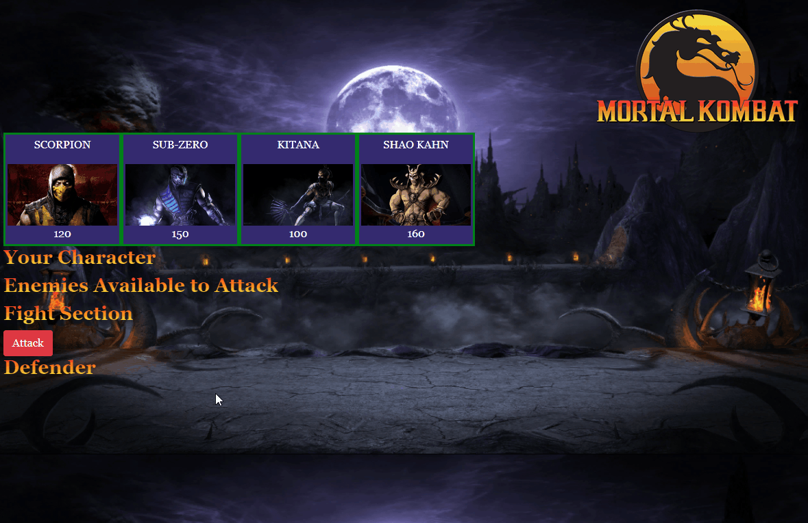
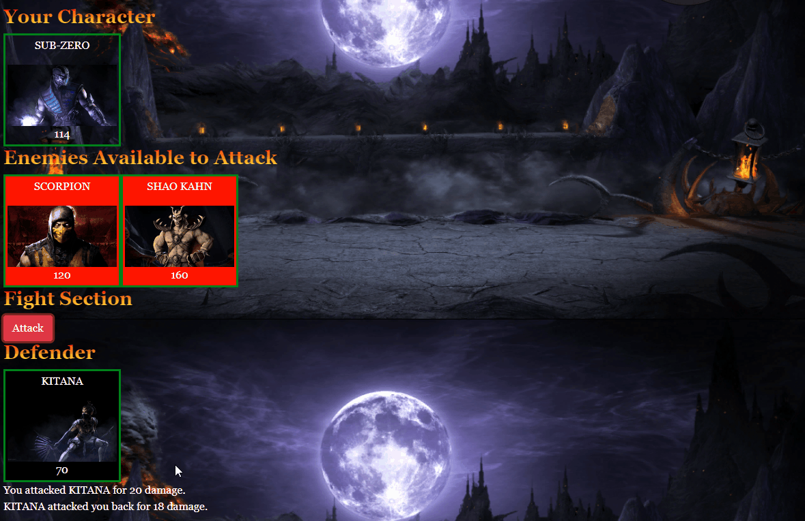
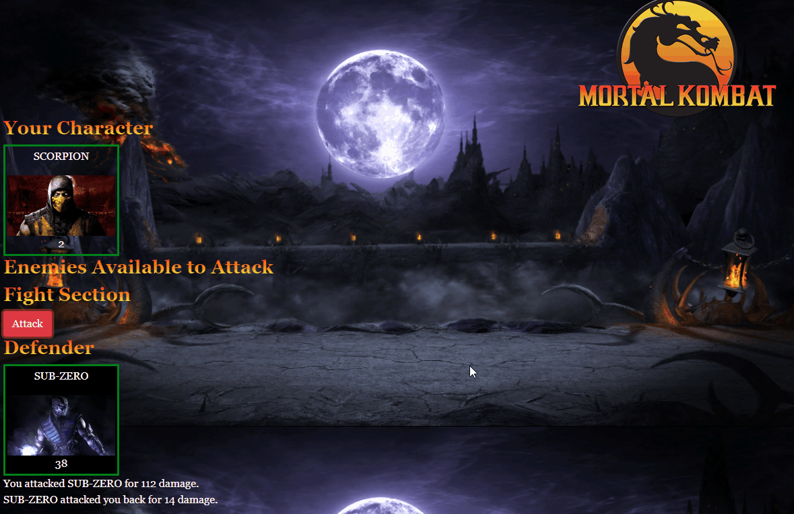

# Mortal Kombat RPG

[Link to Application](https://mmusil2.github.io/RPG-Game/)

### Mortal Kombat themed Javascript based fighting game where a character is selected and used to battle the other characters based on health, attack, and counter attributes

## Technologies Used
HTML, CSS, Javascript, Bootstrap, JQuery

## App Description
Each time the player attacks, their character's Attack Power increases by its base Attack Power. 
For example, if the base Attack Power is 6, each attack will increase the Attack Power by 6 (12, 18, 24, 30 and so on).
The enemy character only has Counter Attack Power.
Unlike the player's Attack Points, Counter Attack Power never changes.
The Health Points, Attack Power and Counter Attack Power of each character must differ.
No characters in the game can heal or recover Health Points. 

## *Select a character and an enemy to begin attacking*

## *Click the "Attack" button to attack the enemy until you or the enemy runs out of Health*

## *Keep attacking enemies until you run out of enemies (YOU WIN) or until your Health is depleted (YOU LOSE)*

A winning player must pick their characters wisely by first fighting an enemy with low Counter Attack Power. This will allow them to grind Attack Power and to take on enemies before they lose all of their Health Points. Healing options would mess with this dynamic.

Player is able to win and lose the game no matter what character they choose. The challenge should come from picking the right enemies, not choosing the strongest player.